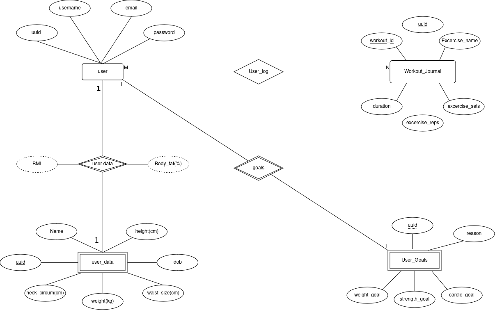

# Javascript-hope

> **My first real full-stack project, from a year I was still learning what `req.session` was. Express + Pug + MariaDB workout/journal app. Kept public as a checkpoint — not because the code is good, because it isn't.**

This repo is from early 2024, when I was working through "Node.js + a database + auth = a real backend" for the first time. The premise was a workout-tracking website with a journal feature. The reality was a crash course in:

- Why you shouldn't store the session secret next to the database password (and then push it to GitHub)
- Why password hashing with `bcrypt` actually matters once a real user signs up
- Why a templating language with whitespace sensitivity (Pug) feels like Python and not, in fact, HTML
- The exact moment when "let's just write the queries by hand" turns into "I have reinvented half of an ORM, badly"

## What it does (or did)

- **Auth:** registration + login with bcrypt-hashed passwords, sessions over `express-session` and a cookie
- **Pages:** landing → register → login → home → journal → workout details (Pug templates, vanilla CSS per page)
- **Database:** MariaDB, raw SQL queries via the `mariadb` driver — no ORM
- **MVC layout:** `routes/`, `controllers/`, `model/` — the Node.js textbook split, with all the boilerplate that implies

## Screens


ER schema (the part I'm most fond of, because designing it forced me to actually think about user → workout → set as a relation problem):



## Run

```bash
npm install
# Set up MariaDB locally, create a database, and put credentials in .env:
#   PORT=3000
#   DB_HOST=localhost
#   DB_USER=...
#   DB_PASS=...
#   SECRET_KEY=<a real random string>
nodemon app.js
```

It listens on `process.env.PORT`. If the page doesn't render, the database probably isn't initialized — there's no migration script, schema lives in a `.drawio.png` and my head.

## Why I keep it public

It's a worse version of code I'd write today. That's the point — it's a marker for "this is what I knew in February 2024" so I can look at it and be grateful for what I've learned since. If you're earlier on the same path, take what's useful and ignore the rest. The code is probably riddled with anti-patterns I now know to avoid (raw SQL string interpolation in places it shouldn't be, no input validation, no CSRF protection on form posts). Don't deploy this somewhere with real users.

The successor — same idea but with the lessons absorbed — is `workout-app-rework` (private now; superseded).
